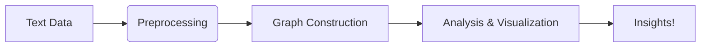

# 📜 LangGraph Tutorial 🚀

Welcome to my **LangGraph Tutorial**! This guide will help you explore the fascinating world of language graphs and their applications.



## 🌟 Features

- 🧠 **Intuitive API** for building language graphs
- 📊 **Interactive visualizations** with popular libraries
- ⚡ **Performance optimizations** for large datasets
- 🧩 **Modular design** for easy customization

## 🛠️ Installation

```bash
pip install langgraph-tutorial
# or
conda install -c conda-forge langgraph-tutorial
```

## 🏁 Quick Start

```python
import langgraph as lg

# Create a simple language graph
graph = lg.Graph()
graph.add_text("Hello world!")
graph.visualize()
```

## 📚 Tutorial Sections

1. 🔤 **Basic Graph Construction**
2. � **Advanced NLP Features**
3. 🎨 **Custom Visualizations**
4. 🏗️ **Real-world Applications**
5. � **Performance Benchmarks**

## 📊 Example Visualization

```
Word Network:
   HELLO
    / \
 WORLD   GRAPH
    \ /
  TUTORIAL
```

## 🤝 Contributing

PRs are welcome! Please see our [Contribution Guidelines](CONTRIBUTING.md).

## 📜 License

MIT © 2023 [Your Name]

---

Made with ❤️ and a lot of ☕ by Nemesis !

Let's build amazing language graphs together! 🌐
